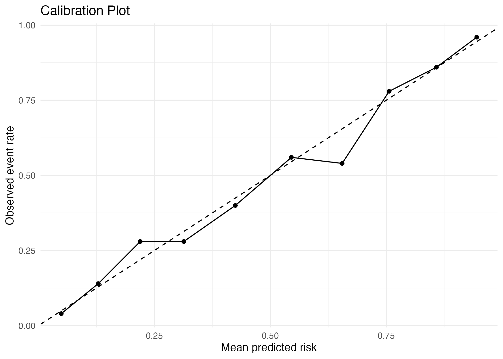
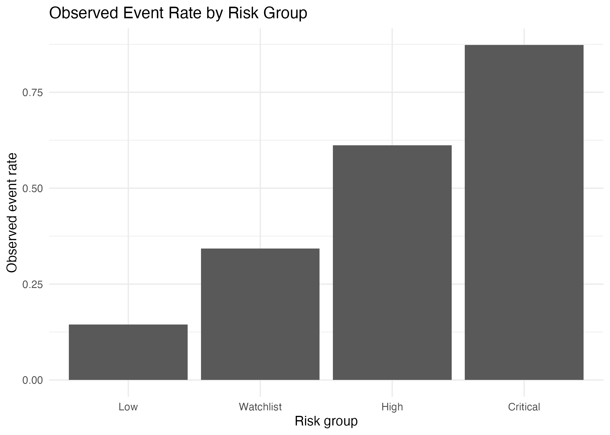
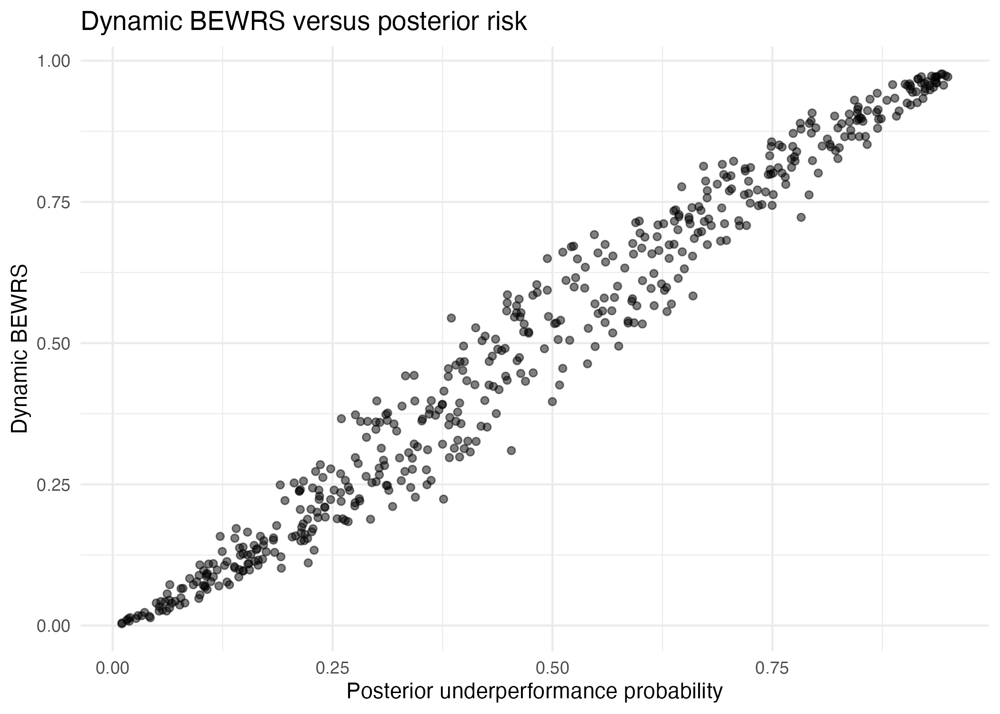

## Overview

`bewrs` provides tools for Bayesian early-warning risk surveillance, dynamic risk scoring, validation, calibration assessment, decision-theoretic intervention optimisation, and Expected Value of Intervention analysis for healthcare performance monitoring.

## Example outputs

### Calibration assessment

### Risk stratification

### Dynamic BEWRS scoring

## Methodological references

The methods implemented in `bewrs` are motivated by work on Bayesian hierarchical modelling, healthcare provider profiling, prediction model validation, calibration assessment, decision curve analysis, and Bayesian decision theory, including:

- Gelman A, Carlin JB, Stern HS, Dunson DB, Vehtari A, Rubin DB. *Bayesian Data Analysis*. 3rd ed. CRC Press; 2013.
- Spiegelhalter DJ. Funnel plots for comparing institutional performance. *BMJ*. 2005;331:302--305. doi:10.1136/bmj.331.7512.302
- Vickers AJ, Elkin EB. Decision curve analysis. *Medical Decision Making*. 2006;26(6):565--574. doi:10.1177/0272989X06295361
- Steyerberg EW, Vickers AJ, Cook NR, et al. Assessing the performance of prediction models. *Epidemiology*. 2010;21(1):128--138. doi:10.1097/EDE.0b013e3181c30fb2
- Van Calster B, McLernon DJ, van Smeden M, Wynants L, Steyerberg EW. Calibration: the Achilles heel of predictive analytics. *BMC Medicine*. 2019;17:230. doi:10.1186/s12916-019-1466-7
